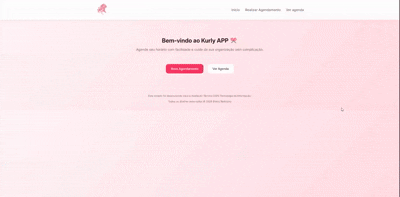
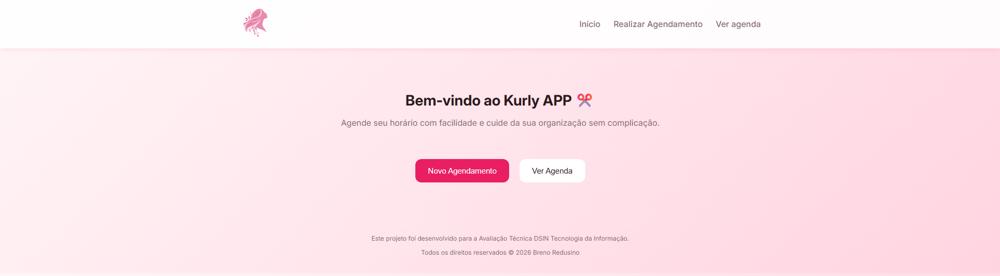
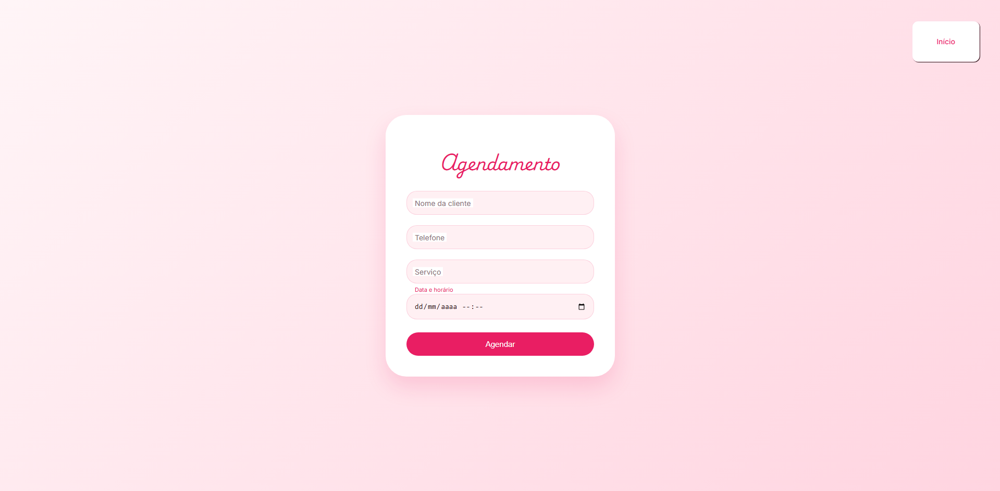
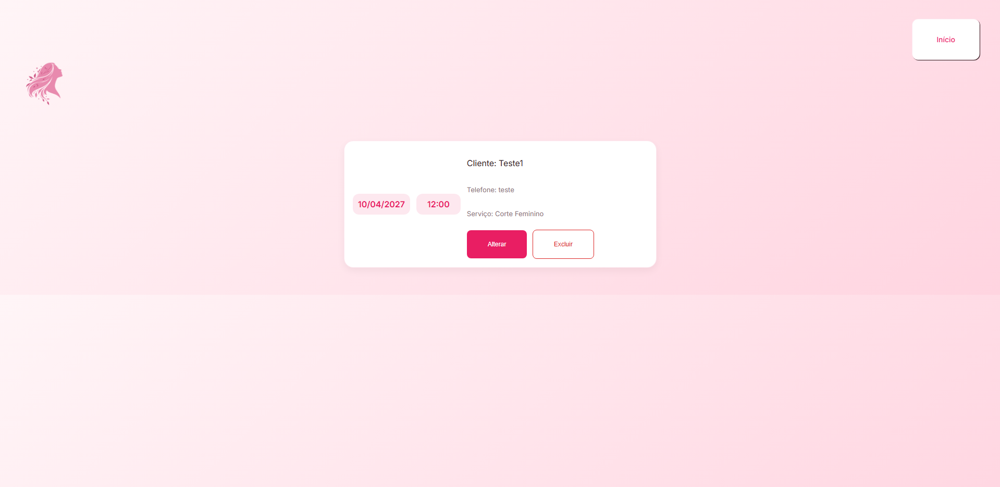

# 💇‍♀️ Kurly - Sistema de Agendamento



---

## ✨ Sobre o Projeto

O **Kurly** é um sistema de agendamento desenvolvido com foco em organização de horários para serviços, permitindo o gerenciamento de clientes e atendimentos de forma simples e eficiente.

O projeto foi desenvolvido como parte de um desafio técnico, com o objetivo de demonstrar conhecimentos em **backend, banco de dados e integração com frontend**.

---

## 🌐 Acesse o Projeto

🔗 https://kurly.onrender.com

---

## 🛠️ Tecnologias Utilizadas

* Python
* Flask
* SQLite
* HTML5
* CSS3
* JavaScript

---

## ⚙️ Funcionalidades

✅ Agendamento de serviços 

✅ Validação de conflitos de horário 

✅ Listagem de agendamentos 

✅ Edição de agendamentos 

✅ Exclusão com confirmação (SweetAlert) 

✅ Interface responsiva 
 
---

## 🧠 Lógica de Negócio

O sistema possui validação para evitar conflitos de horários:

* Um novo agendamento só é permitido se **não houver sobreposição de horários**
* Ao editar um agendamento, o próprio registro é ignorado na verificação
* O cálculo de horários é feito utilizando `datetime`

---

## 🗄️ Banco de Dados

O banco é criado automaticamente ao iniciar o projeto:

* Tabela de clientes
* Tabela de serviços
* Tabela de agendamentos

⚠️ O arquivo `banco.db` não é incluído no repositório, sendo gerado automaticamente.

---

## 🚀 Como Executar o Projeto

```bash
# Clone o repositório
git clone https://github.com/yBreno/Kurly

# Acesse a pasta
cd Kurly

# Instale as dependências
pip install -r requirements.txt

# Execute o projeto
python Kurly.py
```

✔️ O banco será criado automaticamente na primeira execução.

---

## 📱 Responsividade

O sistema foi adaptado para diferentes tamanhos de tela, com foco em:

* Layout em coluna no mobile
* Botões ajustados para toque
* Organização visual em formato de cards

---

## 🎨 Preview





---

## 🚀 Diferenciais

* Sistema publicado em produção (Render)
* Lógica de validação de horários aplicada no backend
* Estrutura simples e organizada
* Interface pensada para usabilidade

---

## 🧠 Aprendizados

Este projeto me permitiu evoluir em:

* Manipulação de datas com Python (`datetime`)
* Integração entre frontend e backend
* Estruturação de rotas com Flask
* Modelagem de banco de dados
* Validação de regras de negócio

---

## 🔮 Próximos Passos

* [ ] Implementar autenticação de usuários
* [ ] Migrar para banco de dados persistente (PostgreSQL)
* [ ] Melhorar UI/UX
* [ ] Adicionar dashboard com métricas

---

## 👨‍💻 Autor

Feito por **Breno** 💜

Este projeto foi desenvolvido para a Avaliação Técnica DSIN Tecnologia da Informação.

---

## ⭐ Se curtir o projeto

Deixa uma ⭐ no repositório!
